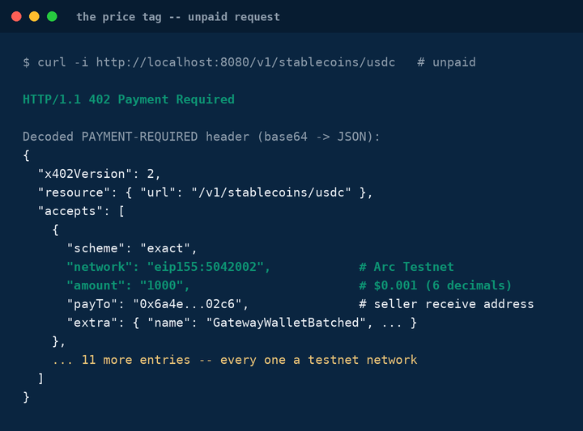
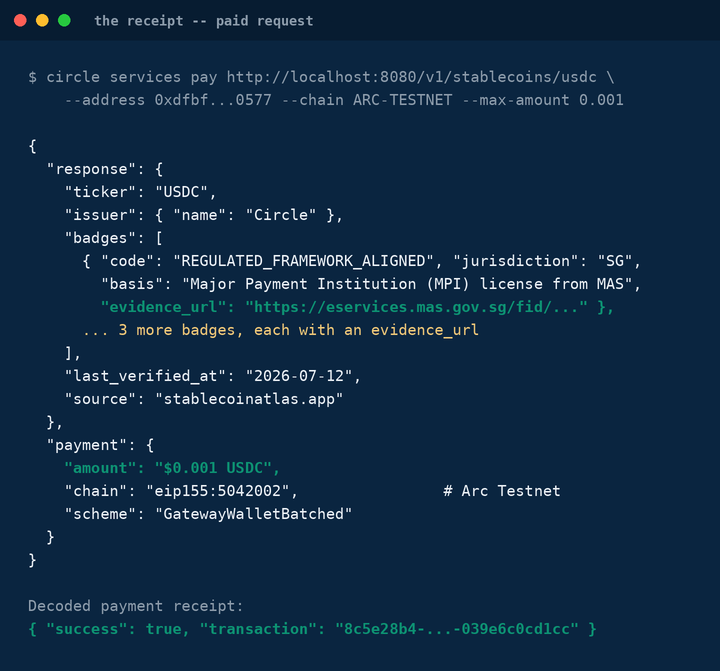

# atlas-agent-api

Stablecoin Atlas data as an agent-payable API. Agents pay $0.001 in USDC per profile call via [x402](https://developers.circle.com/gateway/nanopayments/concepts/x402) + Circle Gateway Nanopayments (gasless, batched settlement).

| Unpaid request → `402` | Paid request → `200` |
|---|---|
|  |  |

## Status

- ✅ **Free API** — teaser list, full profile, and 404 behavior verified against 9 real stablecoin profiles (each badge/regulatory claim carries a real `evidence_url`)
- ✅ **Payment gate — Arc Testnet** — verified end-to-end: unpaid request returns `402` with `accepts[]`, `circle services inspect` reports `payable`, `--estimate` confirms price/chain/seller, and a real paid call settles and returns the full profile
- ⬜ **Mainnet** — not yet enabled (`GATEWAY_NETWORK_ENV` defaults to `testnet`; switching requires an explicit config change, see `CLAUDE.md`)
- ⬜ **Agent Marketplace listing** — not yet submitted

## Endpoints

| Endpoint | Access | Description |
|---|---|---|
| `GET /health` | free | Health check |
| `GET /v1/stablecoins` | free | Teaser list: ticker, name, peg, issuer, badge codes |
| `GET /v1/stablecoins/{ticker}` | **paid** | Full profile: chains, badges with evidence URLs, regulatory status, verification date |

## Quick start

### 1. Free mode

```bash
npm install
cp .env.example .env
npm run dev
curl -s localhost:8080/v1/stablecoins | jq
curl -s localhost:8080/v1/stablecoins/usdc | jq
```

### 2. Testnet payments (402 → 200)

Set `PAYMENTS_ENABLED=true` and a real `SELLER_ADDRESS` in `.env` (`GATEWAY_NETWORK_ENV` defaults to `testnet`, so this stays off mainnet without any extra flag), then:

```bash
# Unpaid request → 402 Payment Required, with accepts[] listing every
# testnet chain/asset/price this endpoint will take
curl -i localhost:8080/v1/stablecoins/usdc

# Pay $0.001 USDC on Arc Testnet via a Circle CLI agent wallet
# (see `circle wallet login`/`circle gateway deposit` to bootstrap one)
circle services pay "http://localhost:8080/v1/stablecoins/usdc" \
  --address <your-testnet-wallet-address> \
  --chain ARC-TESTNET \
  --max-amount 0.001 \
  --output json
# → full USDC profile + a settlement receipt ({"success": true, "transaction": "..."})
```

Full jq-formatted transcripts of both calls: [docs/402-response.txt](docs/402-response.txt), [docs/paid-response.txt](docs/paid-response.txt).

## Enabling payments

See `CLAUDE.md` for the phased build plan (data migration → free API → testnet payment gate → verification → mainnet + Agent Marketplace submission). Short version: set `SELLER_ADDRESS` and `PAYMENTS_ENABLED=true` in `.env`, following the current [Circle seller quickstart](https://developers.circle.com/gateway/nanopayments/quickstarts/seller).

## Data

`data/stablecoins/*.json` — one profile per stablecoin, schema in `src/types.ts`. Mirrored from [stablecoinatlas.app](https://stablecoinatlas.app). Every claim carries an `evidence_url`; every profile a `last_verified_at`.

## Disclaimer

Informational only; not financial, investment, legal, or tax advice.
